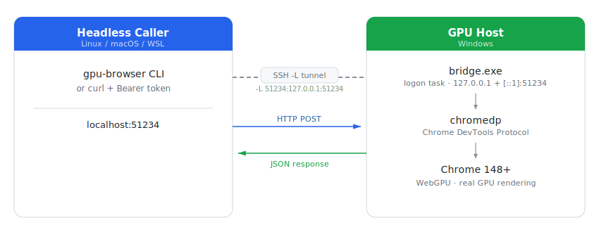

# gpu-browser-bridge

Drive a real GPU-backed Chrome on a remote Windows workstation from a headless host, so WebGPU / WebGL / WebXR code paths can be verified without falling back to software rendering.

**Status:** v1 working end-to-end. Tested on Chrome 148, AMD RDNA-2.

## Why

Headless Chromium has no WebGPU adapter, so any code that branches on `navigator.gpu` either silently falls back to WebGL2 or fails in ways that are invisible to the headless caller. This means:

- Coding agents running on cloud or air-gapped boxes can't verify WebGPU features they just wrote.
- Visual regression in CI doesn't catch GPU-only rendering bugs.
- Anyone doing browser-based ML inference, 3D rendering, or WebXR work on a GPU-less server has no good way to "see what the user sees."

This bridge exposes a Windows workstation's real Chrome (with a GPU) to remote callers over an authenticated HTTP API, so the headless caller can take screenshots, run Playwright specs, and inspect runtime state against the same code path a developer sees in their own browser.

## Architecture

<picture>
  <source media="(prefers-color-scheme: dark)" srcset="./docs/architecture-dark.svg">
  <source media="(prefers-color-scheme: light)" srcset="./docs/architecture-light.svg">
  
</picture>

## Quick start

### GPU host (Windows)

> **No admin required.** Everything installs under your user profile
> (`%LocalAppData%\gpu-browser-bridge`) and runs as a per-user logon Scheduled Task — so you never run an install script as Administrator. The bridge runs in your **interactive desktop session**, which is what gives Chrome a real GPU (a Windows *service* runs in Session 0 with no GPU desktop and hangs on WebGPU).

```powershell
# 1. Install Google Chrome:    https://www.google.com/chrome/
# 2. Clone this repo, then (normal, non-elevated PowerShell):
.\windows\install.ps1
# Builds bridge.exe, generates the token, registers + starts the logon task.
# Prints the bearer token and the caller-side setup snippet.
```

The bridge runs invisibly: `bridge.exe` is built with no console window and Chrome runs in new headless mode (no window at all — and it still uses the real GPU). For unattended reboots, enable auto-logon so a desktop session exists (see [docs/fix-session0-gpu-hang.md](./docs/fix-session0-gpu-hang.md)).

> Upgrading from an older admin/service install? Run `.\windows\uninstall.ps1` once in an **elevated** PowerShell to clear the old admin-created task/service, then run `install.ps1` normally.

### Caller (Linux / macOS / WSL)

```bash
# 1. Open the SSH tunnel (autossh in production, see docs/networking.md)
#    Use 127.0.0.1 (not localhost) for the remote target -- see docs/networking.md.
ssh -N -L 51234:127.0.0.1:51234 <user>@<gpu-host>

# 2. Configure the CLI
mkdir -p ~/.config/gpu-browser
cat > ~/.config/gpu-browser/config <<EOF
BRIDGE_URL=http://localhost:51234
BRIDGE_TOKEN=<token from install.ps1>
EOF

# 3. Smoke test
gpu-browser healthz
gpu-browser screenshot https://example.com/ --out example.png
gpu-browser eval https://example.com/ \
  "(async () => { const a = await navigator.gpu?.requestAdapter(); return a?.info; })()"
```

## API

All POST endpoints require `Authorization: Bearer <token>`. `GET /healthz` is unauthenticated.

| Method | Path | Body | Returns |
|--------|------|------|---------|
| `GET`  | `/healthz` | — | `{ok, chrome_alive, uptime_s}` |
| `POST` | `/screenshot` | `{url, viewport_w?, viewport_h?, wait_for?, full_page?, ignore_https_errors?, settle_ms?, timeout_ms?}` | `{png_b64, console[], failed_requests[]}` |
| `POST` | `/eval` | `{url, script, wait_for?, ignore_https_errors?, settle_ms?, timeout_ms?}` | `{result, console[], failed_requests[]}` |

`script` runs in page context after navigation + optional wait; the final expression's value is returned. Promises are awaited.

## Install

### Pre-built binaries

Download from the [latest release](../../releases/latest):

| Binary | Platform | Description |
|--------|----------|-------------|
| `bridge.exe` | Windows amd64 | GPU host binary |
| `gpu-browser-linux-amd64` | Linux amd64 | Caller CLI |
| `gpu-browser-linux-arm64` | Linux arm64 | Caller CLI |
| `gpu-browser-darwin-amd64` | macOS Intel | Caller CLI |
| `gpu-browser-darwin-arm64` | macOS Apple Silicon | Caller CLI |

On the caller:

```bash
curl -Lo gpu-browser https://github.com/ajmeese7/gpu-browser-bridge/releases/latest/download/gpu-browser-linux-amd64
chmod +x gpu-browser
sudo mv gpu-browser /usr/local/bin/
```

### Build from source

```bash
go build -ldflags "-H=windowsgui" -o bridge.exe ./cmd/bridge  # Windows host binary (no console window)
go build -o gpu-browser ./cmd/gpu-browser                     # caller CLI (cross-platform)
```

Go 1.26+ required (pulled in by chromedp).

## Docs

- [SPEC.md](./SPEC.md) — full design, milestones (v0–v2), design decisions
- [docs/networking.md](./docs/networking.md) — SSH tunnel and Tailscale recipes
- [docs/security.md](./docs/security.md) — threat model, what's protected and not
- [windows/README.md](./windows/README.md) — install / uninstall / token rotation
