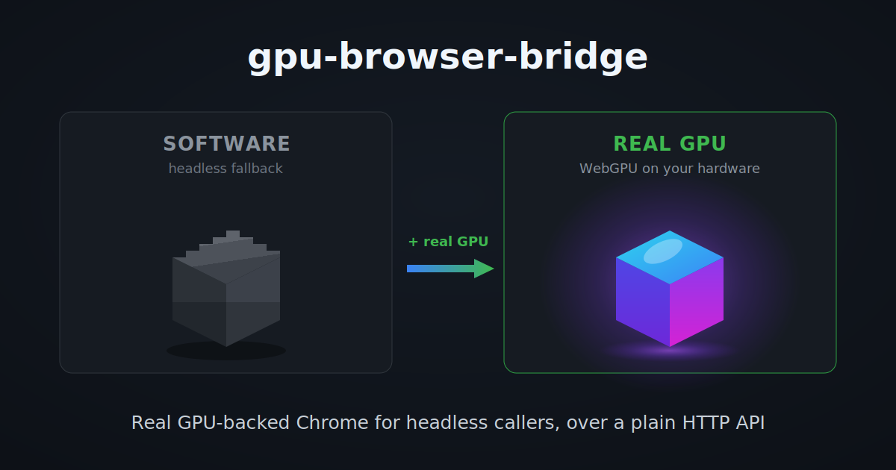

# Social preview image

GitHub's repo social preview (Settings -> General -> Social preview). Recommended dimensions are **1200x630px** (the OpenGraph standard most platforms expect).

## Concept

A social card gets a ~1-second glance at thumbnail size, so it sells the *idea*, not the plumbing. This one is a before/after: a dull, banded, aliased software-rendered cube (the SwiftShader fallback headless callers normally get) next to a vivid, lit, glowing GPU-rendered cube (what the bridge gives you). The payoff is legible without reading a word.

This is intentionally a different image from the README architecture diagram (`architecture-dark.svg` / `architecture-light.svg`). That diagram is the *explainer* for someone already reading the README; the social card is the *hook*. They no longer share a source.

## Files

- `social-preview.svg` - the source. Edit this, never the PNG. Two isometric cubes on a subtly vignetted background. The left uses posterized (hard-stop) gray gradients and a pixel-stepped top face (the stair-steps are baked into the polygon, not overlaid) to read as aliased/software; the right uses smooth vivid gradients, a radial glow halo, floor bloom, and a specular highlight. Text is deliberately large and sparse so it survives at thumbnail size in a feed.
- `social-preview.png` - the rendered 1200x630 export uploaded to GitHub.

## Regenerating the PNG

Rendered with headless Chromium. Chromium adds an 8px body margin to a standalone SVG, which would shift and crop the output, so the SVG is wrapped in a zero-margin HTML page to get a pixel-exact frame.

Run from the `docs/` directory:

```bash
cat > social-render.html <<'EOF'
<!doctype html><html><head><meta charset="utf-8">
<style>html,body{margin:0;padding:0;background:#0d1117}</style></head>
<body></body></html>
EOF

chromium --headless --no-sandbox --disable-gpu --force-device-scale-factor=1 \
  --hide-scrollbars --window-size=1200,630 --default-background-color=00000000 \
  --screenshot=social-preview.png "file://$PWD/social-render.html"

rm -f social-render.html
```

Verify with `file social-preview.png` (expect `PNG image data, 1200 x 630`).

`--force-device-scale-factor=1` keeps it at exactly 1200x630; bump it to `2` if you ever want a 2x retina export (the window-size stays 1200x630, the output doubles).
